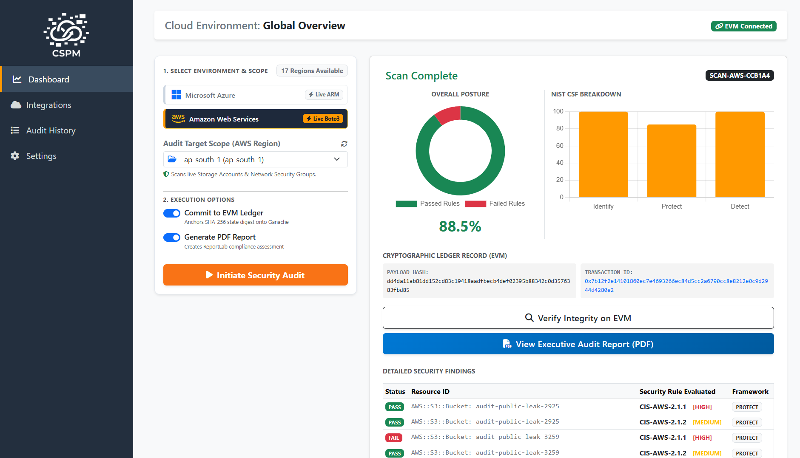
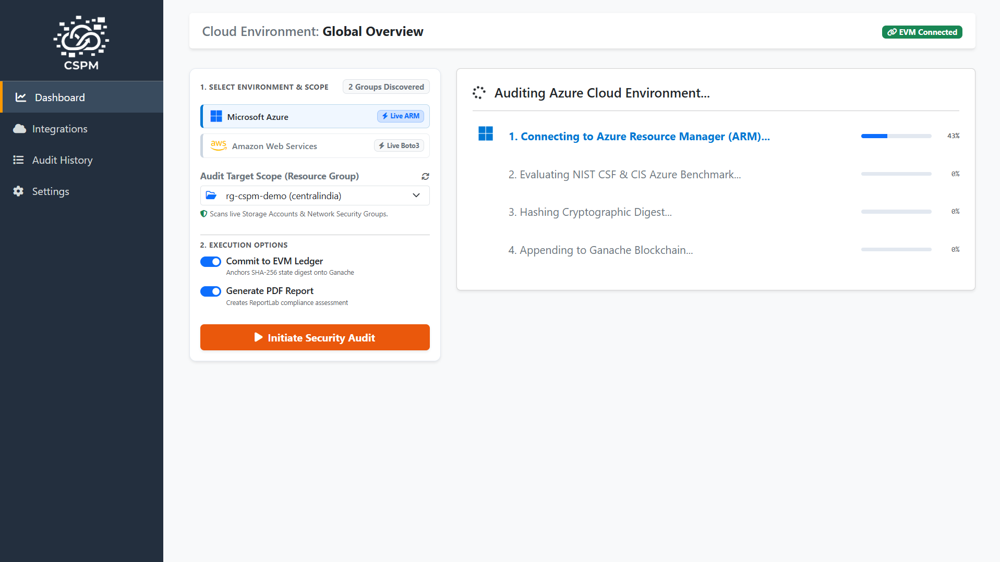
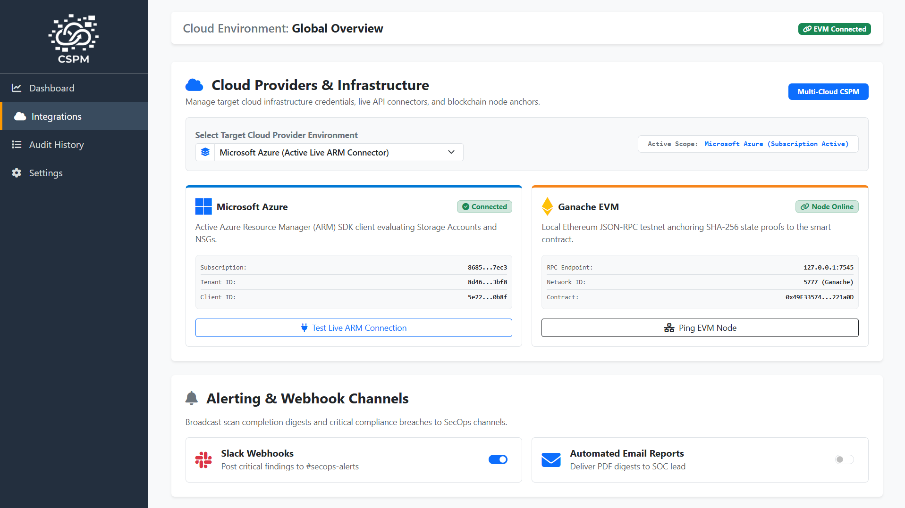
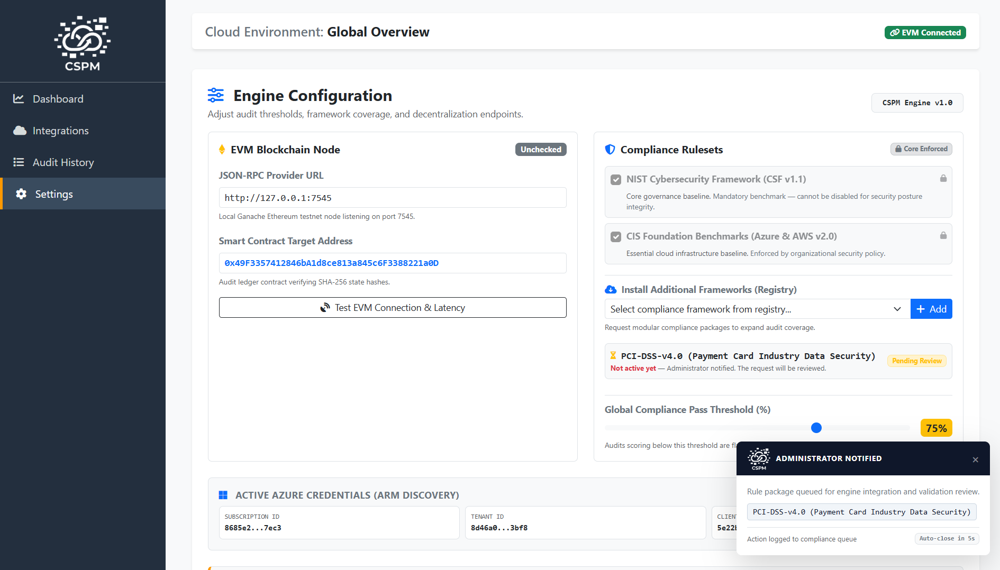
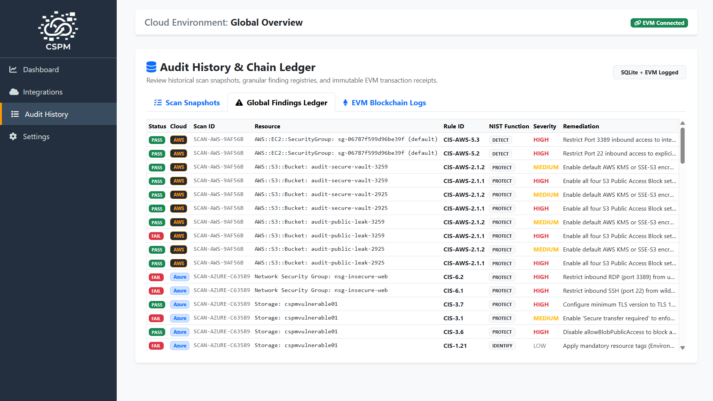
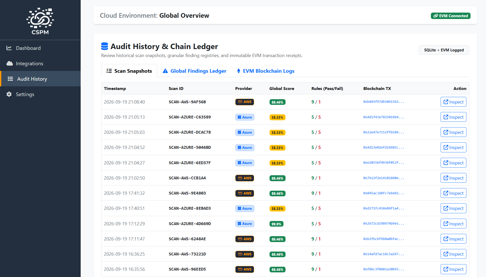
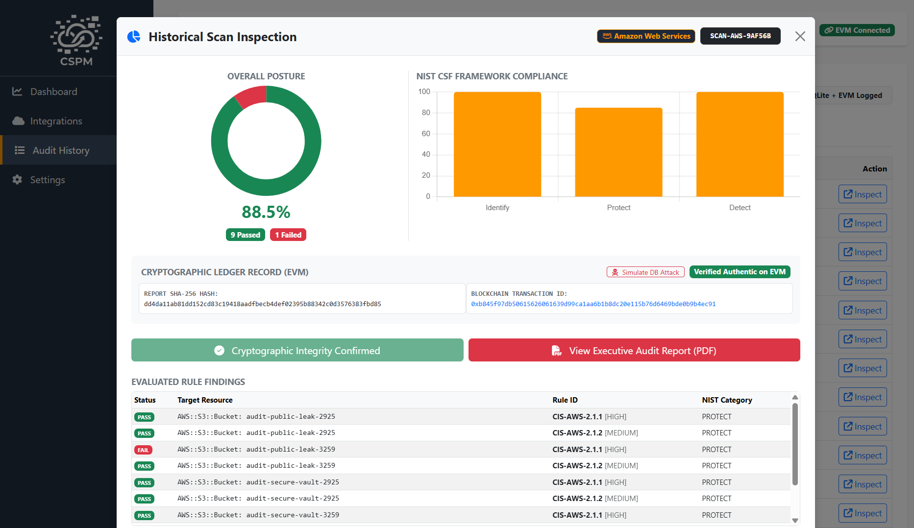
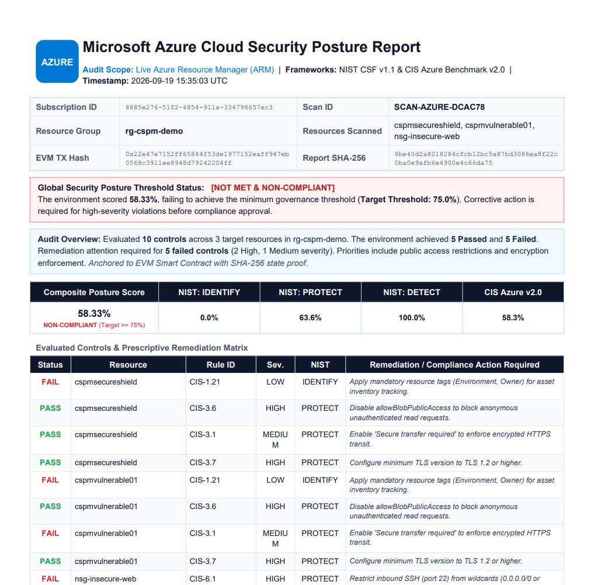

# CloudGuard-CSPM: Multi-Cloud Posture Management & Blockchain-Anchored Audit Platform

[](#)
[](#)
[](#)
[](#)
[](#)

> **Core Research & Engineering Project**  
> Architected and developed in equal 50/50 collaboration by **[@Harman-0622](https://github.com/Harman-0622)** and **[@Anmol2426](https://github.com/Anmol2426)**. Both authors contributed equally to system design, dual-cloud engine integration, blockchain verification, and full-stack implementation.

CloudGuard-CSPM is an enterprise-grade Cloud Security Posture Management (CSPM) platform built to audit multi-cloud infrastructure (AWS & Microsoft Azure) against industry compliance baselines, compute dynamic risk scores, enforce organizational governance pass thresholds, and eliminate audit log tampering by anchoring scan proofs directly onto an Ethereum Virtual Machine (EVM) smart contract.

---

## High-Level Architecture

                      ┌────────────────────────────────────────────────────────┐
                      │                 Target Multi-Cloud Scope               │
                      │     (Azure ARM SDK Resources  |  AWS Boto3 SDK / EC2)  │
                      └───────────────────────────┬────────────────────────────┘
                                                  │
                                                  ▼
                      ┌────────────────────────────────────────────────────────┐
                      │              Multi-Cloud Audit Engines                 │
                      │   - Azure Live Auditor: Storage Accounts, NSG Rules    │
                      │   - AWS Live Auditor: S3 Buckets, Security Groups      │
                      │   - Offline / Synthetic Fallback Parsers               │
                      └───────────────────────────┬────────────────────────────┘
                                                  │
                                                  ▼
                      ┌────────────────────────────────────────────────────────┐
                      │             CSPM Compliance & Rules Engine             │
                      │   - CIS Microsoft Azure Foundations Benchmark v2.0     │
                      │   - CIS Amazon Web Services Benchmark v2.0             │
                      │   - NIST CSF v1.1 Mapping (Identify, Protect, Detect)  │
                      │   - Configurable Global Compliance Pass Threshold      │
                      └───────────────────────────┬────────────────────────────┘
                                                  │
                         ┌────────────────────────┴────────────────────────┐
                         ▼                                                 ▼
          ┌─────────────────────────────┐                   ┌─────────────────────────────┐
          │ Deterministic Hasher Engine │                   │   Executive Report Engine   │
          │    (SHA-256 Digest Tree)    │                   │  (Vector PDF & Remediation) │
          └──────────────┬──────────────┘                   └─────────────────────────────┘
                         │
                         ▼
          ┌─────────────────────────────┐
          │  EVM Smart Contract Anchor  │
          │  (Ganache Immutable State)  │
          └──────────────┬──────────────┘
                         │
                         ▼
          ┌─────────────────────────────┐
          │   Audit Integrity Verifier  │
          │   (Tamper Detection Engine) │
          └─────────────────────────────┘

---

## Key Capabilities

* **Dual-Cloud Live Asset Auditing:** Discovers and audits live resources concurrently across **Microsoft Azure** (`azure-mgmt-resource`, `azure-mgmt-storage`, `azure-mgmt-network`) and **Amazon Web Services (AWS)** (`boto3` for S3 and EC2 Security Groups).
* **Multi-Framework Governance & Scoring:** Inspects cloud assets against **CIS Azure v2.0**, **CIS AWS v2.0**, and maps control metrics directly to core **NIST Cybersecurity Framework (CSF) v1.1** functions (*Identify, Protect, Detect*).
* **Dynamic Global Compliance Threshold:** An interactive governance slider (40%–90%) dynamically establishes the pass/fail baseline. Audits scoring below the threshold are marked **NON-COMPLIANT** in live UI counters and the executive PDF report.
* **Modular Framework Registry:** Features core-enforced baseline rulesets (CIS and NIST) with an extensible administrator request workflow for emerging enterprise packages (PCI-DSS v4.0, SOC 2 Type II, ISO/IEC 27001, HIPAA, and GDPR) equipped with live UI toast notifications.
* **Decentralized Cryptographic Ledger:** Internal threat actors or compromised administrators cannot alter audit scores or history. Every audit run computes a deterministic SHA-256 payload digest and commits it directly to an EVM smart contract (`AuditRegistry.sol` / `AuditLedger.sol`).
* **Active Tamper Detection Engine:** Features an on-demand audit verification modal allowing security auditors to query local SQLite database states against the immutable smart contract on-chain, immediately flagging unauthorized modifications or data drift.
* **Granular Executive PDF Reporting:** Compiles formal, vector-rendered security audit reports using ReportLab, detailing executive summaries, remediation procedures, cryptographic blockchain transaction receipts, and dynamic compliance threshold evaluations.
* **Session Lifecycle Persistence:** Implements robust client-side `localStorage` caching paired with an active `SERVER_BOOT_ID` check, preserving scan states and framework requests across browser tabs while cleanly resetting on server reboots.

---

## Evaluated Security Baselines

### Microsoft Azure Benchmark (CIS Azure v2.0)
| Rule ID | Framework Mapping | Target Resource | Severity | Evaluated Security Baseline |
| :--- | :--- | :--- | :--- | :--- |
| **CIS-1.21** | NIST: IDENTIFY | Storage Accounts | LOW | Enforces mandatory resource tags (`Environment`, `Owner`) for asset discovery |
| **CIS-3.1** | NIST: PROTECT | Storage Accounts | MEDIUM | Enforces `enableHttpsTrafficOnly` to secure transit traffic |
| **CIS-3.6** | NIST: PROTECT | Storage Accounts | HIGH | Restricts anonymous public blob access |
| **CIS-3.7** | NIST: PROTECT | Storage Accounts | HIGH | Validates minimum TLS protocol version is 1.2 or higher |
| **CIS-6.1** | NIST: PROTECT | Network Security Groups | HIGH | Restricts inbound SSH (port 22) exposure from wildcard Internet (`0.0.0.0/0`) |
| **CIS-6.2** | NIST: PROTECT | Network Security Groups | HIGH | Restricts inbound RDP (port 3389) exposure from wildcard Internet (`0.0.0.0/0`) |

### Amazon Web Services Benchmark (CIS AWS v2.0)
| Rule ID | Framework Mapping | Target Resource | Severity | Evaluated Security Baseline |
| :--- | :--- | :--- | :--- | :--- |
| **CIS-AWS-2.1.1** | NIST: PROTECT | S3 Buckets | HIGH | Enforces S3 Block Public Access (`BlockPublicAcls`, `BlockPublicPolicy`) |
| **CIS-AWS-2.1.2** | NIST: PROTECT | S3 Buckets | MEDIUM | Enforces default bucket encryption at rest (SSE-S3 or AWS KMS) |
| **CIS-AWS-2.1.3** | NIST: PROTECT | S3 Buckets | HIGH | Enforces TLS / HTTPS-only in S3 Bucket Policies (`aws:SecureTransport`) |
| **CIS-AWS-5.2** | NIST: PROTECT | EC2 Security Groups | HIGH | Restricts inbound SSH (port 22) ingress from wildcard CIDR (`0.0.0.0/0`) |
| **CIS-AWS-5.3** | NIST: PROTECT | EC2 Security Groups | HIGH | Restricts inbound RDP (port 3389) ingress from wildcard CIDR (`0.0.0.0/0`) |
| **CIS-AWS-1.14** | NIST: IDENTIFY | S3 & EC2 Assets | LOW | Enforces mandatory resource tagging for asset identification and billing |

---

## Application Walkthrough & UI Modules

All interface captures are organized inside `docs/screenshots/`.

---

### 1. Dual-Cloud Security Posture Dashboard
The central console displaying multi-cloud posture scores, dynamic threshold governance status (`COMPLIANT` / `NON-COMPLIANT`), NIST CSF function breakdowns (*Identify, Protect, Detect*), and real-time EVM transaction receipts.



---

### 2. Provider-Aware Dynamic Audit Wizard
A real-time execution overlay that tracks ARM and Boto3 API authentication, CIS baseline rule evaluations, SHA-256 state payload hashing, and block anchoring onto the Ganache EVM ledger with live stage monitors.



---

### 3. Multi-Cloud Integrations & Scope Manager (`/integrations`)
Centralized credential verification and scope manager supporting Microsoft Azure ARM Service Principals and AWS Boto3 IAM access keys with target region and resource group configuration.



---

### 4. Policy Engine Governance & Framework Registry (`/settings`)
Administrative console featuring:
* **Core Enforced Baselines:** Foundational CIS and NIST benchmarks locked by policy to prevent unauthorized deactivation.
* **Dynamic Global Threshold:** Adjustable compliance baseline slider (40%–90%) linked to real-time status calculations.
* **Modular Framework Registry:** Extensible request catalog for enterprise frameworks (PCI-DSS, SOC 2, ISO 27001, HIPAA) with interactive administrator review queue notifications.



---

### 5. Granular Security Findings & Remediation Guide (`/findings`)
Itemized breakdown of detected cloud misconfigurations tagged by CIS ID, severity level (Critical, High, Medium, Low), affected cloud resource ID, and step-by-step remediation procedures.



---

### 6. Forensic Audit History & Cross-Cloud Ledger (`/history`)
A searchable historical repository tracking all scans across Azure and AWS scopes, recording global compliance scores, SHA-256 report digests, EVM transaction hashes, and downloadable executive PDF reports.



---

### 7. Cryptographic Integrity Verification & Tamper Detection
An on-demand verification pipeline querying the immutable blockchain state against local database records to cryptographically detect unauthorized data manipulation or score spoofing.



---

### 8. Executive PDF Compliance Deliverable
Formal, vector-rendered executive reports generated with ReportLab, containing scoring breakdowns, NIST CSF pillar mapping, findings summaries, and blockchain transaction receipts.



---

## Project Structure

```text
cloud-security-audit/
├── .env.example                         # Environment variable template
├── .gitignore                           # Git ignore rules for venv, db, secrets
├── app.py                               # Flask server, API routes, and scan coordinator
├── config.py                            # App configuration and env loader
├── contracts/
│   └── AuditLedger.sol                  # Solidity contract for on-chain state anchoring
├── core/
│   ├── crypto/
│   │   ├── __init__.py                  # Package marker
│   │   └── hasher.py                    # SHA-256 payload digest generator
│   ├── reporting/
│   │   ├── __init__.py                  # Package marker
│   │   └── pdf_generator.py             # ReportLab executive PDF generator
│   ├── rules/
│   │   ├── __init__.py                  # Package marker
│   │   ├── cis_benchmark.py             # CIS rule definitions for Azure and AWS
│   │   ├── nist_mapping.py              # NIST CSF v1.1 function mappings
│   │   └── scoring_engine.py            # Compliance scoring and threshold logic
│   ├── scanner/
│   │   ├── __init__.py                  # Package marker
│   │   ├── aws_live_scanner.py          # Boto3 scanner for S3 and EC2 security groups
│   │   ├── azure_live_scanner.py        # Azure ARM scanner for storage accounts and NSGs
│   │   ├── iam_scanner.py               # IAM and identity posture auditor
│   │   ├── keyvault_scanner.py          # Secrets and Key Vault auditor
│   │   ├── nsg_scanner.py               # Network Security Group rule parser
│   │   └── storage_scanner.py           # Storage configuration parser
│   └── web3_bridge/
│       ├── __init__.py                  # Package marker
│       ├── contract_data.json           # Compiled contract ABI and bytecode
│       ├── contract_interface.py        # Web3.py client for Ganache EVM RPC
│       └── deploy.py                    # Contract deployment script
├── database/
│   ├── db_manager.py                    # SQLite CRUD and schema manager
│   └── schema.sql                       # Database schema definition
├── docs/
│   └── screenshots/                     # Application walkthrough captures
├── mock_data/                           # Offline JSON fixtures for testing
│   ├── entra_id_users.json              # Mock Azure AD/Entra users
│   ├── key_vaults.json                  # Mock Key Vault data
│   ├── network_security_groups.json     # Mock NSG firewall rules
│   └── storage_accounts.json            # Mock storage accounts
├── requirements.txt                     # Project Python dependencies
├── static/
│   ├── css/
│   │   └── custom.css                   # Custom styles and animations
│   ├── img/
│   │   ├── aws_logo.png                 # AWS branding icon
│   │   └── azure_logo.png               # Azure branding icon
│   ├── js/
│   │   ├── charts.js                    # Dashboard Chart.js integration
│   │   ├── verification.js              # EVM integrity check and tamper demo
│   │   └── wizard.js                    # Multi-stage scan runner and polling
│   └── logo.png                         # Application logo
├── templates/
│   ├── base.html                        # Global layout and navbar
│   ├── dashboard.html                   # Main metrics and scan trigger
│   ├── findings.html                    # Granular findings and remediations
│   ├── history.html                     # Scan history and report downloads
│   ├── integrations.html                # Cloud provider credential management
│   ├── settings.html                    # Governance thresholds and framework requests
│   ├── verify_modal.html                # EVM verification modal
│   └── wizard.html                      # Scan progress modal overlay
├── test_azure_conn.py                   # Azure ARM connection test script
├── test_engine.py                       # Scoring engine unit tests
└── test_live_scanner.py                 # Live cloud scanner test harness
```
## Development Roadmap & Status

- [x] **v1.0 - Core Prototype & Ledger Pipeline:**
  - Modular security audit engine evaluating simulated and structured cloud configurations.
  - Web3.py smart contract deployment on Ganache for zero-trust cryptographic audit logs.
  - SQLite metadata storage with SHA-256 tamper-detection verifier.
  - Executive PDF compliance report generation with remediation guidance.

- [x] **v2.0 - Dual-Cloud Live Engine & Governance Platform (Current Release):**
  - Live resource inspection through Azure ARM Python SDK (`azure-mgmt-storage`, `azure-mgmt-network`).
  - Live multi-region AWS inspection via Boto3 (S3 Block Public Access, TLS policies, EC2 Security Groups).
  - Dynamic Global Compliance Threshold slider with interactive pass/fail status binding in UI and PDF exports.
  - Core-locked baseline benchmarks (CIS & NIST) and extensible framework request catalog.
  - Seamless state persistence across browser tabs with server reboot lifecycle resets (`SERVER_BOOT_ID`).

---

## Getting Started

### 1. Prerequisites
* Python 3.10+
* [Ganache](https://trufflesuite.com/ganache/) running locally on `http://127.0.0.1:7545`
* Active AWS account and/or Azure Service Principal credentials (for live scanning)

### 2. Installation
```bash
# Clone the repository
git clone https://github.com/Harman-0622/cloud-security-audit.git
cd cloud-security-audit

# Create and activate virtual environment
python -m venv venv

# Windows (PowerShell):
.\venv\Scripts\activate

# Linux / macOS:
source venv/bin/activate

# Install required dependencies
pip install -r requirements.txt
```
### 3. Environment Configuration
Create a `.env` file in the project root based on `.env.example`:

```ini
# Microsoft Azure ARM Credentials
AZURE_TENANT_ID="your-azure-tenant-id"
AZURE_CLIENT_ID="your-azure-client-id"
AZURE_CLIENT_SECRET="your-azure-client-secret"
AZURE_SUBSCRIPTION_ID="your-azure-subscription-id"

# Amazon Web Services (AWS) Credentials
AWS_ACCESS_KEY_ID="your-aws-access-key-id"
AWS_SECRET_ACCESS_KEY="your-aws-secret-access-key"
AWS_DEFAULT_REGION="ap-south-1"

# Ganache Blockchain Node & Smart Contract
GANACHE_RPC_URL="http://127.0.0.1:7545"
CONTRACT_ADDRESS="0x8B757aD9A22d8C7B07e05C3Bf3B73738B1e"
WALLET_PRIVATE_KEY="your-ganache-account-private-key"
```
### 4. Smart Contract Deployment

1. Start Ganache on port `7545`.
2. Deploy the audit ledger contract:

```bash
python core/web3_bridge/deploy.py
```
3. Copy the output contract address and update `CONTRACT_ADDRESS` in your `.env` file.

### 5. Launch the Platform

```bash
python app.py
```
Open your browser and navigate to `http://127.0.0.1:5000`.

---

## License

Distributed under the MIT License. See `LICENSE` for more information.
